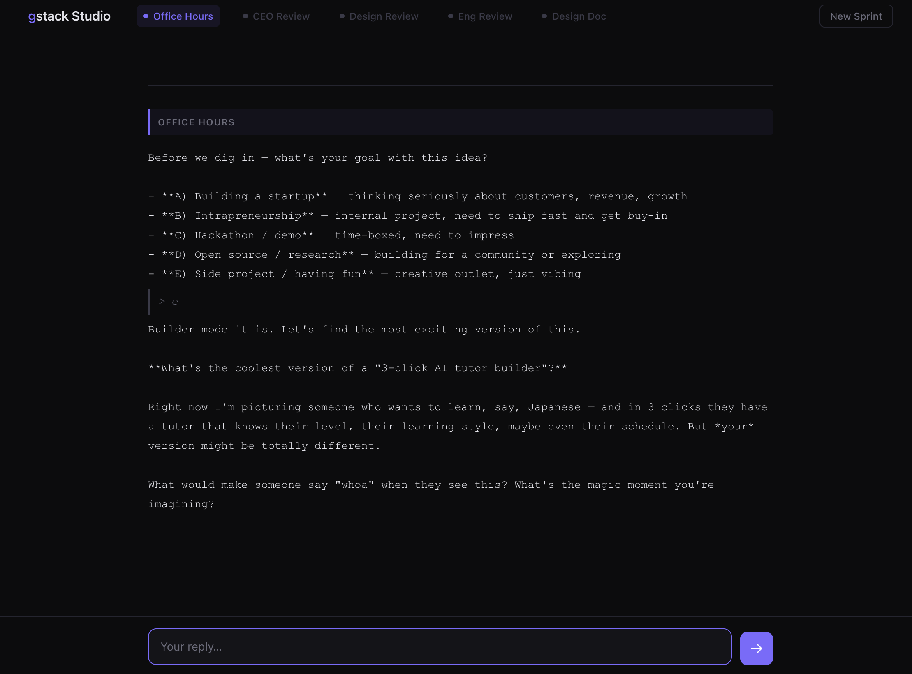

# gstack Studio

*A browser UI for gstack's product ideation sprint — Office Hours → CEO Review → Design Review → Eng Review → Design Doc.*

## Quick start

```sh
npx gstack-studio
```

Your browser opens automatically. If Claude Code or gstack isn't installed, the app will detect it and show you exactly what to run.



## The sprint

| Phase | What happens |
|---|---|
| Office Hours | Your idea gets reframed before you write a line of code |
| CEO Review | Scope challenged, premises tested |
| Design Review | Design dimensions rated and improved |
| Eng Review | Architecture, edge cases, failure modes surfaced |
| Design Doc | Downloadable output artifact |

You control the pace. Advance when you're satisfied with Claude's output.

## Prerequisites

Only needed once:

```sh
npm install -g @anthropic-ai/claude-code && claude login
npm install -g gstack
```

## Mac launcher (no terminal)

Download `gstack-studio.command` from the [latest release](https://github.com/habiz/gstack-studio/releases/latest) and double-click it.

**First run only:** macOS will block it with an "unidentified developer" warning. Right-click → **Open** → **Open** to approve. After that, double-click works normally.

Requires Node.js. Get it at [nodejs.org](https://nodejs.org) if you don't have it.

## Sessions

Every sprint is saved to `~/.gstack-studio/sessions/`. Pick up where you left off.

## How it works

```
Browser ←→ Bun server (localhost:3000) ←→ claude CLI ←→ gstack skills
```

Each phase spawns a claude subprocess with the relevant gstack skill. Output streams live to the browser via SSE.

## Contributing

```sh
git clone https://github.com/habiz/gstack-studio
cd gstack-studio
bun install
bun run start
```

## License

MIT
